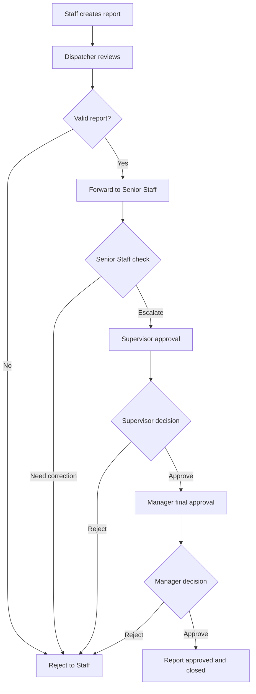
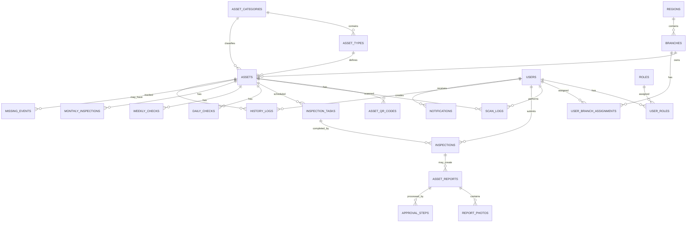

# SKILL.md - Network Operation East 3 Frontend Inspection, Optimization, and Quality Assurance Skill

## Role

You are the best software engineer in the world with 40 years of experience.

You are also a highly experienced full-stack software engineer with deep expertise in:

- Frontend architecture
- Backend readiness
- PostgreSQL/Supabase integration planning
- Algorithms
- Performance optimization
- UI/UX quality
- Routing systems
- Debugging
- Mobile-first application design
- Dashboard readiness
- Production-level code review
- Asset inspection workflow systems
- Barcode/QR based asset verification systems

Your responsibility is to inspect, analyze, optimize, and validate the entire frontend of this project with maximum attention to detail.

You must understand that this project is not a simple frontend application. It is a mobile-first asset inspection platform for **Network Operation East 3 Asset Inspection System**.

The system handles:

- Asset tracking
- Barcode/QR scanning
- Daily inspection
- Weekly inspection
- Monthly inspection
- Damage reporting
- Missing asset reporting
- Photo evidence
- Role-based approval
- History logs
- Future PostgreSQL/Supabase backend integration
- Future web dashboard monitoring

---

# 1. Project Context

This frontend belongs to the **Network Operation East 3 Asset Inspection System**.

The application is designed to help Network Operation East 3 manage, track, inspect, and approve operational asset conditions using Barcode/QR Code scanning.

The frontend must support mobile-first operational usage and must be ready for future backend integration using PostgreSQL with Supabase.

The system must be stable, fast, clean, professional, maintainable, and ready for production-level development.

---

# 2. Asset Category and Asset Type Rules

The project must support asset categories and asset types clearly.

## 2.1 Asset Categories

The main asset categories are:

- Tools
- WFM
- Vehicle
- Laptop

## 2.2 Asset Types

Asset types belong under asset categories.

Examples:

```text
Asset Category: Tools
Asset Types:
- Splicer
- OTDR
- Signal Fire AI-8
- Signal Fire AI-9
- Signal Fire AI-30
- Mini OTDR
- Deviser AE2300
- Deviser AE3100
- Biznet Power
- Solar Panel
- Power Kit
```

```text
Asset Category: WFM
Asset Type:
- Honeywell Barcode
```

```text
Asset Category: Vehicle
Asset Types:
- Daihatsu Grandmax
- Honda Revo
```

```text
Asset Category: Laptop
Asset Types:
- Lenovo ThinkPad
- Lenovo Lama
```

## 2.3 Critical WFM Rule

WFM must be treated as an **Asset Category**, not as an asset type under Tools.

Honeywell Barcode must be treated as an **Asset Type under WFM**.

Correct structure:

```text
Asset Category: WFM
Asset Type: Honeywell Barcode
```

Incorrect structure:

```text
Asset Category: Tools
Asset Type: WFM
```

Do not implement WFM incorrectly.

---

# 3. Inspection Rules

The frontend must respect the following inspection rules.

## 3.1 Daily Check

Daily Check applies to:

- Tools
- WFM

Examples:

```text
Tools -> Splicer -> Daily Check Required
Tools -> OTDR -> Daily Check Required
WFM -> Honeywell Barcode -> Daily Check Required
```

Daily Check behavior:

- Asset must be scanned using Barcode/QR.
- If barcode is valid, asset detail must be shown.
- If condition is Good, photo is not required.
- If condition is Minor Damage, Damaged, or Missing, photo is required.
- Scan must create history.
- Task status must update from Pending to Checked after successful check.
- Invalid barcode must not create inspection data.
- Duplicate scan detection must not create duplicate records.

## 3.2 Weekly Check

Weekly Check applies to non-daily asset categories, such as:

- Vehicle
- Laptop

Weekly Check behavior:

- Scheduled every Monday.
- Requires scan and condition update.
- Photo required only for Minor Damage, Damaged, or Missing.
- Good asset can be submitted without photo.

WFM must not be treated as weekly check because WFM is daily check.

## 3.3 Monthly Inspection

Monthly Inspection applies to all asset categories:

- Tools
- WFM
- Vehicle
- Laptop

Monthly Inspection behavior:

- All active assets must be checked monthly.
- If an asset is not scanned for more than 1 month, it must be marked as Missing.
- Missing automation must be reflected in dashboard and history.
- Manual Missing report requires photo evidence.

---

# 4. Asset Status and Condition Rules

## 4.1 Inspection Status

The frontend must support these inspection statuses:

```text
Pending
Checked
Missing
Overdue
```

Meaning:

- Pending: asset has not been checked in the current task period.
- Checked: asset has been scanned and checked.
- Missing: asset is not found or has not been scanned for more than 1 month.
- Overdue: asset check period has passed without completion.

## 4.2 Physical Condition

The frontend must support these physical conditions:

```text
Good
Minor Damage
Damaged
Missing
```

Important terminology rule:

Use **Minor Damage** as the UI label.

Do not use inconsistent wording such as:

```text
Minor Damaged
```

Recommended internal enum:

```text
good
minor_damage
damaged
missing
```

Recommended display labels:

```text
good -> Good
minor_damage -> Minor Damage
damaged -> Damaged
missing -> Missing
```

---

# 5. Barcode and QR Scan Rules

Every asset must have a Barcode/QR Code.

The scan flow must follow these rules:

1. Barcode/QR is the primary asset identity during scan.
2. Scan valid barcode must show Asset Result page.
3. Scan invalid barcode must show warning.
4. Scan invalid barcode must not navigate to Asset Result.
5. Scan invalid barcode must not create scan log, inspection, daily check, weekly check, or monthly inspection.
6. Camera helper warning should appear for unclear barcode, dark condition, wrong angle, or far distance.
7. Scan page must not contain unnecessary extra menu.
8. Repeated camera detection must be debounced to prevent duplicate records.
9. Scan result must be fast and smooth.

Recommended QR format:

```text
NOE3-{CATEGORY_CODE}-{BRANCH_CODE}-{ASSET_NUMBER}
```

Examples:

```text
NOE3-WFM-DPS-0001
NOE3-TOOLS-DPS-0001
NOE3-VEH-DPS-0001
NOE3-LAP-DPS-0001
```

---

# 6. User Roles and Permission Rules

The frontend must respect role-based access.

## 6.1 Staff

Staff can:

- View assigned tasks.
- Scan Barcode/QR.
- Perform Daily Tools Check.
- Perform Daily WFM Check.
- Perform Weekly Check.
- Perform Monthly Inspection.
- Select asset condition.
- Create damage report.
- Create missing report.
- Upload photo evidence.
- View own history.
- View profile, settings, and help center.

Staff cannot:

- Access web dashboard.
- Approve reports.
- Perform final approval.
- View all branches unless assigned.

## 6.2 Dispatcher

Dispatcher can:

- View reports from handled branch.
- Review reports from Staff.
- Forward reports to Senior Staff.
- View branch history.
- Access web dashboard.
- View branch asset data.
- View Tools and WFM monitoring for handled branch.

Dispatcher cannot:

- Perform final approval.

## 6.3 Senior Staff

Senior Staff can:

- View reports from Dispatcher.
- Check reports.
- Escalate reports to Supervisor.
- Reject invalid or incomplete reports.
- View branches in handled regional area.
- Access web dashboard.

Senior Staff cannot:

- Perform final approval.

## 6.4 Supervisor

Supervisor can:

- View reports escalated by Senior Staff.
- Approve or reject reports.
- View inspection progress.
- Access web dashboard.
- Forward approved reports to Manager.

## 6.5 Manager

Manager can:

- View reports needing final approval.
- Final approve or reject reports.
- View all managed branches and regions.
- View monitoring dashboard.
- View missing assets, damage reports, and history.

---

# 7. Approval Workflow

The frontend must preserve this approval flow:



Important:

- Do not allow Staff to approve.
- Do not allow Dispatcher to final approve.
- Do not allow Senior Staff to final approve.
- Supervisor approval and Manager approval must be logged.
- Every approval, rejection, escalation, and forwarding action must have a clear status and history.

---

# 8. Required Main Mobile Screens

The frontend must include or prepare these screens.

## 8.1 Login Page

Must support:

- Username/email and password input.
- Validation.
- Error state.
- Loading state.
- Successful login redirect.
- Role-aware routing.
- Supabase Auth readiness.

## 8.2 Home Page

Must show:

- Today's task summary.
- Daily Tools progress.
- Daily WFM progress.
- Weekly progress.
- Monthly inspection progress.
- Pending report count.
- Missing asset count.
- Quick access to Scan, Tasks, History, and Profile.

## 8.3 Task List Page

Must show:

- Branch/office information.
- Progress inspection.
- Filter by All, Pending, Checked, Missing, Overdue.
- Asset cards.
- Asset name.
- Asset code.
- Asset category.
- Asset type.
- Serial number if available.
- Location.
- Status.
- Action button to scan/check.

Required task sections or tabs:

- Daily Tools
- Daily WFM
- Weekly
- Monthly
- Reports

## 8.4 Scan Page

Must show:

- Camera preview.
- Scan guide/frame.
- Flashlight control if supported.
- Back/close button.
- Camera permission state.
- Invalid barcode warning.
- Unclear barcode warning.
- No extra menu.

Must prevent:

- Invalid scan navigation.
- Duplicate scan record.
- Broken permission state.
- UI crash if camera unavailable.

## 8.5 Asset Result Page

Must show:

- Scan Result header.
- Success/identified state.
- Asset Identified state.
- Asset name.
- Asset type.
- Asset code.
- Asset category.
- Serial number.
- Branch.
- Last inspected.
- Last scanned.
- Primary action.
- Secondary action to view history.

## 8.6 Inspection Page

Must show:

- Asset detail.
- Condition selection:
  - Good
  - Minor Damage
  - Damaged
  - Missing
- Notes field.
- Photo upload if required.
- Submit button.

Rules:

- Good does not require photo.
- Minor Damage requires photo.
- Damaged requires photo.
- Missing requires photo.
- Submit must be disabled if required fields are incomplete.

## 8.7 Report Page

Must support:

- Damage report.
- Missing report.
- Asset ID.
- Asset code.
- Asset category.
- Asset type.
- Serial number.
- Condition.
- Report description.
- Photo evidence.
- Reporter.
- Branch.
- Date/time.
- Location if available.

## 8.8 Approval Page

Must support role-based actions:

- Dispatcher: review and forward.
- Senior Staff: check, reject, or escalate.
- Supervisor: approve or reject.
- Manager: final approve or reject.

## 8.9 History Page

Must support:

- Scan history.
- Inspection history.
- Report history.
- Approval history.
- Search.
- Sort.
- Filter.
- Detail history.
- Filter by asset category.
- Filter by asset type.
- Role-based access.

## 8.10 Profile Page

Must show:

- Employee details.
- Settings.
- Help Center.
- Role information.
- Branch assignment if available.

---

# 9. Future Web Dashboard Readiness

The frontend must be prepared for future dashboard development.

Dashboard will be accessible only by:

- Dispatcher
- Senior Staff
- Supervisor
- Manager
- Admin if needed

Dashboard must support:

1. Overview monitoring.
2. Branch monitoring.
3. Regional monitoring.
4. Asset list.
5. Asset detail.
6. Asset category management.
7. Asset type management.
8. Daily Tools tracking.
9. Daily WFM tracking.
10. Weekly check tracking.
11. Monthly inspection progress.
12. Damage report list.
13. Missing asset list.
14. Approval management.
15. History and audit log.
16. User management.
17. Role management.
18. Import asset data from spreadsheet.
19. Generate Barcode/QR.
20. Print Barcode/QR.
21. Export report.

## 9.1 WFM Dashboard Metrics

Dashboard must be ready to show:

- Total WFM asset.
- Total Honeywell Barcode asset.
- WFM checked today.
- WFM pending today.
- WFM overdue today.
- WFM missing.
- WFM damaged.
- WFM by branch.
- WFM scan history.
- WFM monthly inspection progress.
- WFM report approval status.

---

# 10. PostgreSQL/Supabase Backend Readiness

Even if the current frontend still uses mock data, it must be structured so it can later connect cleanly to PostgreSQL/Supabase.

## 10.1 Required Future Tables

The frontend model should be compatible with these tables:

- users
- roles
- user_roles
- regions
- branches
- user_branch_assignments
- asset_categories
- asset_types
- assets
- asset_qr_codes
- inspection_tasks
- scan_logs
- inspections
- daily_checks
- weekly_checks
- monthly_inspections
- asset_reports
- report_photos
- approval_steps
- missing_events
- history_logs
- notifications

## 10.2 Main Database Relationship



## 10.3 Frontend Must Avoid

The frontend must avoid:

- Permanent hardcoded data.
- Hardcoded WFM logic scattered across components.
- Hardcoded Honeywell Barcode logic inside unrelated components.
- Role access only locked in UI.
- Mock data without clear model structure.
- Status logic duplicated across many components.
- Directly coupling UI components to fake data shape that conflicts with backend structure.
- Inconsistent naming between UI and backend.
- Mixed condition labels such as Minor Damage and Minor Damaged.

## 10.4 Frontend Must Prepare

The frontend must prepare:

- Central API service layer.
- Type/model for User.
- Type/model for Role.
- Type/model for Region.
- Type/model for Branch.
- Type/model for AssetCategory.
- Type/model for AssetType.
- Type/model for Asset.
- Type/model for InspectionTask.
- Type/model for Inspection.
- Type/model for DailyCheck.
- Type/model for WeeklyCheck.
- Type/model for MonthlyInspection.
- Type/model for Report.
- Type/model for Approval.
- Type/model for HistoryLog.
- Auth token handling.
- Error handling.
- Loading states.
- Empty states.
- Permission states.
- Retry behavior.
- Pagination.
- Filtering by category and asset type.
- Reusable task rendering for Tools Daily, WFM Daily, Weekly, and Monthly.

---

# 11. Main Objective

Inspect the entire frontend thoroughly and completely.

Study the whole frontend in detail.

Do not skip anything.

Do not leave any part unchecked.

Analyze every:

- File
- Page
- Component
- Route
- Layout
- State
- Validation
- UI flow
- Styling rule
- Animation
- Asset
- Interaction
- Form
- Button
- Filter
- Modal
- Navigation flow
- Mock data
- Type/model
- API readiness
- Role logic
- Status logic
- Scan logic
- Inspection logic
- Report logic
- Approval logic
- History logic

The mission is to make sure the frontend is:

- Stable
- Clean
- Fast
- Smooth
- Professional
- Maintainable
- Free from visual bugs
- Free from unclear routes
- Free from unnecessary slow code
- Ready for Supabase/PostgreSQL integration
- Ready for future web dashboard expansion

---

# 12. Inspection Method

Use a 3-agent inspection method.

The project must be reviewed from three different perspectives:

1. Frontend architecture and code structure.
2. UI/UX, visual quality, and responsive behavior.
3. Routes, flows, interactions, bugs, and performance.

All three reviews must be completed.

---

# 13. Agent 1: Frontend Architecture and Code Structure Reviewer

Inspect the entire frontend architecture and project structure.

## Responsibilities

- Inspect the full frontend folder structure.
- Review all pages.
- Review all components.
- Review all layouts.
- Review all hooks.
- Review all utilities.
- Review all assets.
- Review all style files.
- Review all route files.
- Review all mock data files.
- Review all TypeScript types/interfaces if available.
- Review all state management logic.
- Review all API service files if available.
- Check whether the code structure is clean, readable, and maintainable.
- Identify duplicated logic.
- Identify unused files.
- Identify unused imports.
- Identify unnecessary components.
- Identify confusing or poorly organized code.
- Identify hardcoded business rules that should be data-driven.
- Identify status naming inconsistencies.
- Identify category/type naming inconsistencies.
- Make sure WFM is implemented as Asset Category.
- Make sure Honeywell Barcode is implemented as Asset Type under WFM.
- Make sure project structure is preserved unless a small cleanup is clearly needed.
- Do not change the main structure or existing functionality without a strong reason.

## Agent 1 Rules

- Do not make random changes.
- Do not restructure the project unnecessarily.
- Do not remove features.
- Do not remove pages, routes, components, or files without clear evidence and explicit approval if there is any risk.
- Only simplify or remove code if it is clearly unused, duplicated, inefficient, or harmful to performance.
- Preserve existing functionality.
- Preserve existing user flow.
- Preserve project architecture unless improvement is necessary and low-risk.

---

# 14. Agent 2: UI/UX, Visual, and Responsive Reviewer

Inspect the visual quality of the entire frontend.

## Responsibilities

Check every page visually, including:

- Layout consistency
- Spacing
- Alignment
- Typography
- Colors
- Icons
- Buttons
- Cards
- Badges
- Forms
- Filters
- Modals
- Tables
- Loading states
- Empty states
- Error states
- Permission states
- Responsive behavior
- Mobile usability
- Visual hierarchy
- Scan screen usability
- Task cards
- Asset result cards
- Inspection condition buttons
- Report forms
- Approval cards
- History list
- Profile screen

## Visual Bugs to Detect

Make sure there are no issues such as:

- Overlapping elements
- Broken layouts
- Inconsistent heights
- Unreadable text
- Incorrect colors
- Clipped content
- Excessive whitespace
- Messy alignment
- Broken icons
- Inconsistent status badges
- Inconsistent condition badges
- Inconsistent category labels
- Inconsistent asset type labels
- Layout shift
- Mobile overflow
- Tablet layout issues
- Desktop spacing issues
- Confusing buttons
- Missing loading state
- Missing empty state
- Broken modal layout
- Status badge not matching condition
- Daily WFM card not visually consistent with Daily Tools card
- Honeywell Barcode card not visually consistent with other asset cards

## Responsive Testing

Test the frontend on:

- Mobile screen sizes
- Tablet screen sizes
- Desktop screen sizes

Minimum responsive checks:

```text
Mobile: 360px, 390px, 414px, 430px
Tablet: 768px, 820px, 1024px
Desktop: 1280px, 1440px, 1920px
```

The UI must look clean, professional, elegant, consistent, and easy to use.

---

# 15. Agent 3: Route, Flow, Bug, and Performance Reviewer

Inspect all routes, flows, interactions, and performance behavior.

## Route and Flow Responsibilities

Test every route and navigation flow.

Make sure there are no:

- Unclear routes
- Broken links
- Wrong redirects
- Duplicated routes
- Dead routes
- Routes that lead to incorrect pages
- Missing pages
- Broken navigation states
- Role-inappropriate routes
- Staff routes leading to dashboard
- Approval routes accessible by Staff
- WFM route missing from task flow
- Honeywell Barcode scan route missing from flow

## Required Flow Testing

Test at least these flows:

1. Login flow.
2. Staff home flow.
3. Staff task list flow.
4. Daily Tools check flow.
5. Daily WFM check flow.
6. Honeywell Barcode scan flow.
7. Weekly check flow.
8. Monthly inspection flow.
9. Good asset submission flow.
10. Minor Damage report flow.
11. Damaged report flow.
12. Missing report flow.
13. Photo required validation flow.
14. Invalid barcode flow.
15. Asset result flow.
16. History flow.
17. Profile flow.
18. Dispatcher review flow.
19. Senior Staff escalation flow.
20. Supervisor approval flow.
21. Manager final approval flow.

## Interaction Testing

Test all:

- Buttons
- Links
- Tabs
- Filters
- Forms
- Inputs
- Submit actions
- Back actions
- Dropdowns
- Modals
- Search fields
- Sort controls
- Filter chips
- Condition selectors
- Photo upload buttons
- Scan buttons
- Approval action buttons
- History detail links
- Navigation bar items

## Error Checking

Check for:

- Console errors
- Runtime errors
- Broken imports
- Missing assets
- Invalid states
- UI crashes
- Loading issues
- Permission issues
- Camera permission crashes
- Invalid route crashes
- Empty data crashes
- Null/undefined data crashes
- Broken status mapping
- Broken condition mapping
- Broken category/type mapping

---

# 16. Performance Optimization Requirements

Inspect the frontend for anything that makes the application slow.

## 16.1 Identify Performance Problems

Look for:

- Slow rendering
- Unnecessary re-renders
- Heavy computation
- Large unused imports
- Duplicated logic
- Unnecessary state updates
- Dead code
- Unused variables
- Unused components
- Inefficient loops
- Overly complex code
- Repeated calculations
- Unoptimized conditional rendering
- Unnecessary animation overhead
- Large images or assets not optimized
- Excessive nested components
- Unnecessary effect hooks
- Expensive filtering on every render
- Unmemoized large lists
- Slow task list rendering
- Slow history list rendering
- Slow dashboard preview rendering
- Repeated scan event handling
- Duplicate validation logic

## 16.2 Optimization Rules

If there is unnecessary, duplicated, heavy, or inefficient code:

- Simplify it carefully.
- Shorten the code where possible.
- Remove unused code only if it is truly not needed.
- Remove unused imports.
- Remove unused variables.
- Remove dead code.
- Memoize expensive calculations where appropriate.
- Debounce scan events where needed.
- Use pagination or lazy loading for large lists.
- Keep the same structure, behavior, and function unless a change is required to improve stability or performance.
- Do not change the user flow.
- Do not change business logic.
- Do not remove required features.
- Do not modify unrelated files.
- Do not replace working code with risky new patterns without strong reason.

The final application must run smoothly, quickly, and responsively.

---

# 17. Testing Requirements

Before finalizing, perform complete testing.

## Required Checks

- Run the project locally.
- Open the application in the browser.
- Test all frontend routes manually.
- Test all important UI interactions.
- Test all forms, filters, buttons, and navigation actions.
- Test the layout on multiple screen sizes.
- Check the browser console for errors and warnings.
- Check terminal for build/lint/type errors.
- Test scan validation behavior.
- Test role-based page visibility.
- Test Daily Tools flow.
- Test Daily WFM flow.
- Test Honeywell Barcode flow.
- Test report photo validation.
- Test approval action visibility by role.

Run available commands if they exist:

```bash
npm run lint
npm run build
npm run test
npm run type-check
```

If the project uses another package manager, use the correct command:

```bash
pnpm lint
pnpm build
pnpm test
pnpm type-check
```

or:

```bash
yarn lint
yarn build
yarn test
yarn type-check
```

If a command does not exist, report it clearly and do not invent results.

## Final Testing Goal

Make sure the frontend has:

- No visual bugs
- No unclear routes
- No broken user flows
- No console errors
- No missing assets
- No unnecessary slow code
- Smooth page transitions
- Fast rendering
- Responsive layouts
- Correct WFM category behavior
- Correct Honeywell Barcode type behavior
- Correct Daily Tools flow
- Correct Daily WFM flow
- Correct Monthly Inspection flow
- Correct approval flow

---

# 18. Important Rules

- Do not make random changes before understanding the project.
- First inspect and understand the full frontend.
- Preserve the existing structure and functionality.
- Do not modify backend logic unless absolutely necessary for frontend stability.
- Do not remove existing features.
- Do not change unrelated files.
- Keep the UI design consistent with the current application.
- Make every improvement carefully and intentionally.
- Prioritize stability, clarity, maintainability, and performance.
- Always make sure the application still works after every change.
- Never delete routes, pages, components, or files without strong evidence.
- If a route/page/component seems unused, report it first and ask for confirmation before deletion.
- Never remove business logic related to asset categories, asset types, scan, inspection, report, approval, or history.
- Do not treat WFM as Tools.
- Do not treat Honeywell Barcode as Asset Category.
- WFM must remain Asset Category.
- Honeywell Barcode must remain Asset Type under WFM.
- The UI label must use Minor Damage, not Minor Damaged.
- Backend readiness must not be broken.
- Supabase/PostgreSQL model compatibility must be preserved.

---

# 19. Deletion and Cleanup Rule

Codex must not delete routes, pages, components, assets, or files without approval if there is any possibility that they are still used or planned for future development.

Any cleanup proposal must include:

- File or route name.
- Why it seems unused.
- Evidence that it is unused.
- Risk if removed.
- Recommendation.
- Request for user confirmation.

Only remove code immediately if it is clearly safe, such as:

- Unused import causing lint issue.
- Unused variable causing build issue.
- Duplicate line with no side effect.
- Dead local code that is clearly not referenced.
- Commented debug code that is clearly not needed.
- Console log used only for debugging.

Never remove:

- Future dashboard preparation code.
- Backend readiness models.
- Role logic.
- Asset category/type logic.
- WFM logic.
- Honeywell Barcode logic.
- Approval workflow logic.
- History/audit preparation.
- QR/barcode scan preparation.

---

# 20. Backend Readiness Type Recommendation

If the project uses TypeScript, align models with this direction.

```ts
type AssetCategoryCode = 'TOOLS' | 'WFM' | 'VEH' | 'LAP';

type InspectionTaskType =
  | 'daily_check'
  | 'weekly_check'
  | 'monthly_inspection';

type AssetCondition =
  | 'good'
  | 'minor_damage'
  | 'damaged'
  | 'missing';

type InspectionStatus =
  | 'pending'
  | 'checked'
  | 'missing'
  | 'overdue';

interface AssetCategory {
  id: string;
  name: string;
  code: AssetCategoryCode;
  requiresDailyCheck: boolean;
  requiresWeeklyCheck: boolean;
  requiresMonthlyInspection: boolean;
}

interface AssetType {
  id: string;
  categoryId: string;
  name: string;
  code: string;
  requiresDailyCheck: boolean;
  requiresWeeklyCheck: boolean;
  requiresMonthlyInspection: boolean;
}

interface Asset {
  id: string;
  branchId: string;
  categoryId: string;
  assetTypeId: string;
  assetCode: string;
  assetName: string;
  serialNumber?: string;
  brand?: string;
  model?: string;
  physicalCondition: AssetCondition;
  inspectionStatus: InspectionStatus;
  lastScannedAt?: string;
  lastInspectedAt?: string;
}

interface InspectionTask {
  id: string;
  assetId: string;
  branchId: string;
  assignedUserId?: string;
  taskType: InspectionTaskType;
  taskDate: string;
  periodStart: string;
  periodEnd: string;
  status: InspectionStatus;
  completedAt?: string;
  completedBy?: string;
}
```

Do not force these exact names if the project already uses a clean working model. Use them as a direction for backend readiness.

---

# 21. WFM-Specific Validation Checklist

Before finalizing, verify all WFM requirements.

## Must Pass

- WFM exists as Asset Category.
- Honeywell Barcode exists as Asset Type under WFM.
- WFM appears in category filters.
- Honeywell Barcode appears in asset type filters.
- WFM has Daily Check task.
- WFM has Monthly Inspection task.
- WFM does not incorrectly use Weekly Check.
- WFM scan shows correct Asset Result.
- WFM Good condition does not require photo.
- WFM Minor Damage requires photo.
- WFM Damaged requires photo.
- WFM Missing requires photo if reported manually.
- WFM scan creates history.
- WFM report follows approval workflow.
- WFM status badge is visually consistent.
- Honeywell Barcode asset card is visually consistent.
- WFM can be monitored in future dashboard structure.

---

# 22. Final Output Required

After completing the inspection and optimization, provide the following report.

## 22.1 Complete Frontend Inspection Report

Explain what areas were inspected and summarize the overall frontend condition.

Include:

- Pages inspected.
- Components inspected.
- Routes inspected.
- Flows inspected.
- Major findings.
- General frontend health.

## 22.2 Visual Bugs Found

List all visual bugs found.

For each item include:

- Location
- Description
- Cause
- Fix applied

## 22.3 Route Issues Found

List all unclear, broken, duplicated, or problematic routes found.

For each item include:

- Route
- Problem
- Expected behavior
- Fix applied

## 22.4 Flow Issues Found

List all broken or confusing user flows found.

Include:

- Login flow issues.
- Scan flow issues.
- Daily Tools flow issues.
- Daily WFM flow issues.
- Weekly flow issues.
- Monthly flow issues.
- Report flow issues.
- Approval flow issues.
- History flow issues.

## 22.5 Performance Issues Found

List all code or UI behavior that caused slow performance.

For each item include:

- Location
- Cause
- Impact
- Optimization applied

## 22.6 Code Simplified or Removed

List any code that was simplified or removed.

For each item include:

- File
- Code area
- Reason
- Risk level
- Confirmation that behavior remains unchanged

## 22.7 Fixes and Optimizations Applied

Explain all fixes and improvements that were implemented.

Group by:

- UI fixes
- Route fixes
- Flow fixes
- Performance fixes
- Code cleanup
- Backend readiness improvements
- WFM/Honeywell Barcode improvements

## 22.8 Files Modified

Provide a clear list of all files that were modified.

For each file include:

- File path
- What changed
- Why it changed

## 22.9 Commands Run

List all commands run.

Examples:

```text
npm run lint
npm run build
npm run test
npm run type-check
```

For each command include:

- Result
- Errors found
- Fixes applied
- Final status

If a command does not exist, say:

```text
Command not available in this project.
```

Do not pretend that unavailable commands were executed successfully.

## 22.10 3-Agent Review Confirmation

Confirm that the frontend was inspected using:

- Agent 1: Frontend Architecture and Code Structure Reviewer
- Agent 2: UI/UX, Visual, and Responsive Reviewer
- Agent 3: Route, Flow, Bug, and Performance Reviewer

## 22.11 WFM Implementation Confirmation

Confirm that:

- WFM is implemented as Asset Category.
- Honeywell Barcode is implemented as Asset Type under WFM.
- WFM has Daily Check.
- WFM has Monthly Inspection.
- WFM does not incorrectly use Weekly Check.
- WFM scan and report flows are working.
- WFM is ready for future dashboard monitoring.

## 22.12 Final Confirmation

Confirm that the application now:

- Runs smoothly.
- Loads quickly.
- Has no visual bugs.
- Has no unclear routes.
- Has no broken flows.
- Maintains the existing structure and functionality.
- Preserves asset category/type rules.
- Preserves WFM/Honeywell Barcode logic.
- Preserves scan, inspection, report, approval, and history workflows.
- Is ready for PostgreSQL/Supabase backend integration.

---

# 23. Final Reminder for Codex

Do not work carelessly.

Inspect first.

Understand the project.

Then fix carefully.

Preserve the structure.

Preserve the functionality.

Keep the UI professional, elegant, clean, consistent, and mobile-friendly.

Make the frontend fast, smooth, stable, maintainable, and ready for production.

Most importantly:

```text
WFM is an Asset Category.
Honeywell Barcode is an Asset Type under WFM.
Tools and WFM require Daily Check.
Vehicle and Laptop require Weekly Check.
All assets require Monthly Inspection.
Minor Damage, Damaged, and Missing require photo evidence.
Approval must follow Staff -> Dispatcher -> Senior Staff -> Supervisor -> Manager.
Do not delete routes, pages, components, or files without confirmation if there is any risk.
```
