# PRD - Network Operation East 3 Asset Inspection System

## Revision Note

Dokumen ini adalah revisi PRD untuk menambahkan struktur baru:

- **WFM adalah Asset Category tersendiri.**
- **Honeywell Barcode adalah Asset Type di dalam Asset Category WFM.**
- Asset Category WFM memiliki kewajiban **Daily Check**, sama seperti Tools seperti Splicer dan OTDR.
- WFM tetap wajib mengikuti **Monthly Inspection**.
- WFM dapat discan menggunakan Barcode/QR Code.
- WFM dapat dimonitor pada mobile app dan web dashboard.
- WFM dapat memiliki status Good, Minor Damage, Damaged, atau Missing.
- WFM dapat membuat report damage/missing dengan photo evidence dan approval workflow.

Dokumen ini disusun agar Codex dapat membaca, memahami, dan merancang struktur aplikasi, database, korelasi data, dan workflow dengan jelas.

---

# 1. Product Overview

Network Operation East 3 Asset Inspection System adalah aplikasi untuk melakukan pendataan, tracking, inspeksi, pelaporan kondisi, dan approval asset operasional berbasis Barcode/QR Code.

Sistem ini membantu tim Network Operation East 3 memastikan seluruh asset selalu terdata, dapat dilacak, dicek secara rutin, dan memiliki riwayat kondisi yang jelas. Setiap asset akan ditempel Barcode/QR Code. User melakukan scan menggunakan aplikasi mobile untuk mengidentifikasi asset, mengecek kondisi, mencatat status, dan membuat report jika asset rusak atau hilang.

Produk ini dirancang sebagai sistem operasional lengkap yang terdiri dari:

- Mobile app untuk staff lapangan dan role approval.
- PostgreSQL backend menggunakan Supabase.
- Web dashboard untuk monitoring, approval, asset management, user management, dan barcode/QR management.
- Struktur database yang scalable untuk minimal 1000 user.
- Audit trail untuk scan, inspection, report, approval, asset update, dan QR generation.

---

# 2. Product Goals

Tujuan utama produk:

1. Memastikan setiap asset memiliki Barcode/QR Code yang dapat discan.
2. Memastikan asset kategori **Tools** dicek setiap hari.
3. Memastikan asset kategori **WFM** dicek setiap hari.
4. Memastikan asset selain Tools dan WFM dicek rutin setiap minggu pada hari Senin.
5. Memastikan semua asset tetap menjalani monthly inspection.
6. Menandai asset sebagai Missing secara otomatis jika tidak discan lebih dari 1 bulan.
7. Memastikan asset rusak memiliki report dengan foto bukti.
8. Membuat alur approval kerusakan sampai level Manager.
9. Menyediakan history scan, inspection, report, dan approval.
10. Menyiapkan mobile app terlebih dahulu sebelum membangun web dashboard.
11. Menyiapkan sistem agar siap dihubungkan ke PostgreSQL/Supabase.
12. Menyiapkan struktur dashboard agar dapat memonitor Tools, WFM, Vehicle, Laptop, dan asset lainnya.

---

# 3. Scope

## 3.1 In Scope - Mobile App Phase

Fase pertama fokus pada aplikasi mobile.

Fitur mobile app:

- Login dan role-based access.
- Task list asset.
- Scan Barcode/QR asset.
- Validasi Barcode/QR.
- Asset result page.
- Daily check untuk Tools.
- Daily check untuk WFM.
- Weekly check untuk asset selain Tools dan WFM.
- Monthly inspection untuk semua asset.
- Damage report dengan foto wajib.
- Missing report dengan foto wajib.
- Approval workflow dasar.
- History scan dan inspection.
- Profile user.
- Backend readiness untuk PostgreSQL/Supabase.
- Full testing menggunakan Codex dengan 3 agent sebelum dashboard dibuat.

## 3.2 In Scope - Web Dashboard Phase

Dashboard dibuat setelah mobile app stabil dan lolos testing.

Fitur dashboard:

- Overview monitoring.
- Monitoring regional, branch, asset, scan, inspection, dan report.
- Monitoring daily check Tools.
- Monitoring daily check WFM.
- Monitoring weekly check asset non-daily.
- Monitoring monthly inspection semua asset.
- Approval report untuk role Dispatcher ke atas.
- Asset management.
- Asset category management.
- Asset type management.
- User management.
- Role management.
- Branch dan regional management.
- Generate dan print Barcode/QR.
- Import data asset dari spreadsheet.
- Export report.
- Audit log.

Dashboard hanya dapat diakses oleh:

- Dispatcher
- Senior Staff
- Supervisor
- Manager
- Admin, jika dibutuhkan

Staff tidak memiliki akses web dashboard.

## 3.3 Out of Scope - Initial Phase

Hal berikut tidak menjadi fokus awal:

- Dashboard web sebelum mobile app stabil.
- Integrasi penuh WFM/POP sebelum flow utama mobile dan backend siap.
- Advanced analytics.
- Predictive maintenance.
- Offline-first sync kompleks, kecuali diputuskan kemudian.

---

# 4. User Roles

## 4.1 Staff

Staff adalah user lapangan yang melakukan scan dan pengecekan asset.

Hak akses Staff:

- Melihat task scan miliknya.
- Melakukan scan Barcode/QR.
- Melakukan daily check untuk Tools.
- Melakukan daily check untuk WFM.
- Melakukan weekly check untuk asset selain Tools dan WFM.
- Melakukan monthly inspection.
- Memilih kondisi asset.
- Membuat damage report jika asset Minor Damage atau Damaged.
- Membuat missing report jika asset tidak ditemukan.
- Upload foto bukti untuk report damage/missing.
- Melihat history miliknya sendiri.
- Melihat profile, detail karyawan, settings, dan help center.

Staff tidak dapat melakukan approval.

## 4.2 Dispatcher

Dispatcher bertugas menerima report dari Staff dan meneruskan ke Senior Staff.

Hak akses Dispatcher:

- Melihat report dari Staff pada branch yang di-handle.
- Melihat history Staff dan branch yang di-handle.
- Melakukan review awal report.
- Meneruskan report ke Senior Staff.
- Mengakses web dashboard.
- Melihat data asset pada branch yang menjadi tanggung jawabnya.
- Melihat monitoring Tools dan WFM pada branch yang di-handle.

Dispatcher tidak menjadi approval final.

## 4.3 Senior Staff

Senior Staff bertugas melakukan pengecekan dan eskalasi.

Hak akses Senior Staff:

- Melihat report dari Dispatcher.
- Melakukan check terhadap report.
- Melakukan escalate ke Supervisor.
- Melakukan reject jika data tidak valid atau tidak lengkap.
- Melihat semua branch pada regional yang di-handle.
- Mengakses web dashboard.
- Melihat monitoring Tools, WFM, Vehicle, Laptop, dan asset lainnya pada regional yang di-handle.

Senior Staff tidak memiliki hak approval final.

## 4.4 Supervisor

Supervisor memiliki hak approval.

Hak akses Supervisor:

- Melihat report yang dieskalasi oleh Senior Staff.
- Melakukan approve atau reject.
- Melihat branch sesuai area/regional yang di-handle.
- Melihat progress inspection.
- Mengakses web dashboard.
- Meneruskan report yang sudah disetujui ke Manager.

## 4.5 Manager

Manager adalah level approval akhir.

Hak akses Manager:

- Melihat seluruh report yang membutuhkan approval akhir.
- Melakukan final approve atau reject.
- Melihat semua branch pada semua regional yang di-handle.
- Melihat monitoring asset, progress, missing asset, damage report, dan history.
- Mengakses web dashboard.

---

# 5. Organization and Approval Hierarchy

## 5.1 Approval Flow

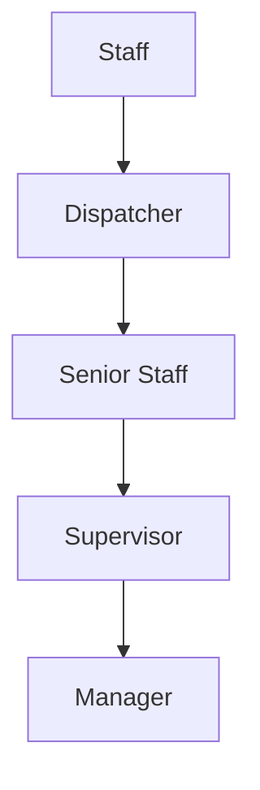

## 5.2 Organization Flow

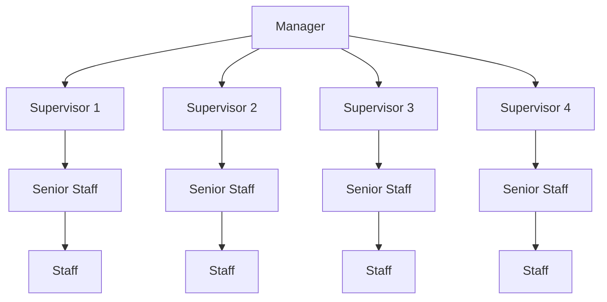

---

# 6. Asset Categories and Asset Types

Asset dibagi menjadi beberapa kategori utama.

## 6.1 Asset Category: Tools

Tools adalah perangkat kerja teknis yang harus selalu tersedia dan ter-tracking setiap hari.

Contoh Asset Type pada Tools:

- Splicer
- Signal Fire AI-8
- Signal Fire AI-9
- Signal Fire AI-30
- OTDR
- Deviser AE2300
- Deviser AE3100
- Mini OTDR
- Biznet Power
- Solar Panel
- Power Kit

Rules:

- Tools wajib Daily Check.
- Tools wajib Monthly Inspection.
- Tools tidak wajib Weekly Check.

## 6.2 Asset Category: WFM

WFM adalah kategori asset tersendiri yang digunakan untuk mendukung aktivitas operasional field, termasuk perangkat barcode scanner atau device kerja berbasis WFM.

Asset Type awal pada kategori WFM:

- Honeywell Barcode

Rules:

- WFM wajib Daily Check.
- WFM wajib Monthly Inspection.
- WFM tidak wajib Weekly Check.
- WFM dapat dibuatkan Barcode/QR Code.
- WFM dapat masuk task harian.
- WFM dapat memiliki report damage/missing.
- WFM dapat masuk approval workflow.
- WFM harus muncul sebagai kategori tersendiri di dashboard.

Contoh asset:

```text
Asset Category : WFM
Asset Type     : Honeywell Barcode
Asset Code     : WFM-HB-E3-DPS-001
Asset Name     : Honeywell Barcode Scanner 001
Branch         : Denpasar
Daily Check    : Required
Monthly Check  : Required
```

## 6.3 Asset Category: Vehicle

Vehicle adalah kendaraan operasional.

Contoh Asset Type:

- Mobil Daihatsu Grandmax
- Motor Honda Revo

Rules:

- Vehicle wajib Weekly Check setiap Senin.
- Vehicle wajib Monthly Inspection.
- Vehicle tidak wajib Daily Check.

## 6.4 Asset Category: Laptop

Laptop adalah perangkat kerja karyawan atau operasional.

Contoh Asset Type:

- Lenovo ThinkPad Baru
- Lenovo Lama

Rules:

- Laptop wajib Weekly Check setiap Senin.
- Laptop wajib Monthly Inspection.
- Laptop tidak wajib Daily Check.

## 6.5 Asset Category and Type Relationship

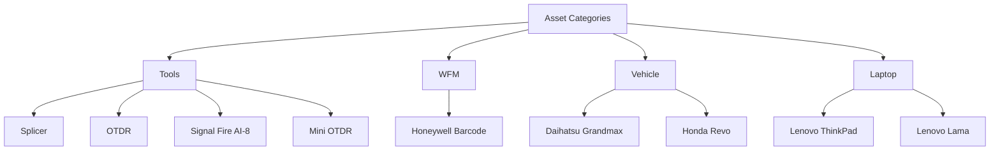

---

# 7. Inspection Schedule Rules

## 7.1 Daily Check

Daily Check berlaku untuk:

- Asset Category: Tools
- Asset Category: WFM

Tujuan:

- Memastikan Tools tersedia setiap hari.
- Memastikan WFM tersedia setiap hari.
- Memastikan perangkat penting lapangan selalu ter-tracking.
- Mengetahui siapa user terakhir yang melakukan scan.
- Mengurangi risiko asset hilang.

Ketentuan:

- Dilakukan setiap hari.
- Cukup melakukan scan Barcode/QR.
- Foto tidak wajib jika kondisi Good.
- Jika scan valid, daily check tercatat.
- Jika tidak discan, asset tetap masuk daftar pending daily check.
- Jika ditemukan Minor Damage, Damaged, atau Missing, user wajib membuat report dengan foto.

## 7.2 Weekly Check

Weekly Check berlaku untuk asset selain Tools dan WFM.

Berlaku untuk:

- Vehicle
- Laptop
- Asset non-daily lain jika ditambahkan di masa depan

Ketentuan:

- Dilakukan setiap minggu pada hari Senin.
- Minimal melakukan scan dan update status.
- Foto hanya wajib jika ada damage/missing report.

## 7.3 Monthly Inspection

Monthly Inspection berlaku untuk semua asset.

Berlaku untuk:

- Tools
- WFM
- Vehicle
- Laptop
- Semua kategori asset lain

Ketentuan:

- Semua asset wajib dicek bulanan.
- Jika asset tidak discan lebih dari 1 bulan, sistem otomatis menandai asset sebagai Missing.
- Jika ditemukan kondisi Minor Damage, Damaged, atau Missing, user wajib membuat report dengan foto.

## 7.4 Inspection Rule Matrix

| Asset Category | Asset Type Example | Daily Check | Weekly Check | Monthly Inspection |
|---|---|---:|---:|---:|
| Tools | Splicer | Yes | No | Yes |
| Tools | OTDR | Yes | No | Yes |
| WFM | Honeywell Barcode | Yes | No | Yes |
| Vehicle | Grandmax | No | Yes | Yes |
| Vehicle | Honda Revo | No | Yes | Yes |
| Laptop | Lenovo ThinkPad | No | Yes | Yes |

---

# 8. Barcode and QR Code Requirement

Setiap asset wajib memiliki Barcode/QR Code.

Ketentuan:

1. Barcode/QR ditempel pada setiap asset.
2. Barcode/QR digunakan sebagai identitas utama saat scan.
3. Scan valid harus menampilkan detail asset.
4. Scan invalid harus menampilkan warning dan tidak boleh lanjut ke asset result.
5. Tools dibuatkan QR berdasarkan data awal spreadsheet.
6. WFM dibuatkan QR berdasarkan data awal spreadsheet.
7. Honeywell Barcode sebagai asset type pada kategori WFM wajib memiliki QR/Barcode.
8. Data spreadsheet menjadi sumber awal untuk generate QR dan import asset ke database.
9. Sistem harus mendukung print Barcode/QR pada dashboard web.

Recommended QR value format:

```text
NOE3-{CATEGORY_CODE}-{BRANCH_CODE}-{ASSET_NUMBER}
```

Contoh:

```text
NOE3-WFM-DPS-0001
NOE3-TOOLS-DPS-0001
NOE3-VEH-DPS-0001
NOE3-LAP-DPS-0001
```

---

# 9. Asset Status and Condition

## 9.1 Inspection Status

Inspection status menunjukkan status proses pengecekan.

Status:

- Pending
- Checked
- Missing
- Overdue

Definisi:

- Pending: asset belum dicek dalam periode task berjalan.
- Checked: asset sudah berhasil discan dan dicek.
- Missing: asset tidak ditemukan atau tidak discan lebih dari 1 bulan.
- Overdue: asset melewati periode check tetapi belum dicek.

## 9.2 Asset Physical Condition

Physical condition menunjukkan kondisi fisik asset.

Kondisi:

- Good
- Minor Damage
- Damaged
- Missing

Definisi:

- Good: asset baik dan dapat digunakan.
- Minor Damage: asset memiliki kerusakan ringan tetapi mungkin masih dapat digunakan.
- Damaged: asset rusak dan perlu penanganan.
- Missing: asset tidak ditemukan.

Catatan standar istilah:

- Gunakan display label **Minor Damage**.
- Hindari campuran istilah **Minor Damaged** di UI.
- Database dapat menggunakan enum `minor_damage`, sedangkan UI menampilkan `Minor Damage`.

---

# 10. Missing Asset Rule

Sistem harus otomatis menandai asset sebagai Missing jika asset tidak discan lebih dari 1 bulan.

Rule ini berlaku untuk semua kategori:

- Tools
- WFM
- Vehicle
- Laptop

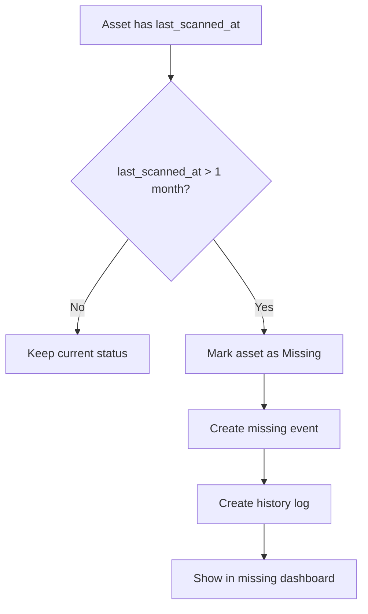

Catatan:

- Missing otomatis harus tercatat dalam history.
- Missing manual juga harus tersedia jika Staff menemukan asset tidak ada saat task berjalan.
- Missing report membutuhkan foto bukti jika dilaporkan manual.
- Missing otomatis dapat dibuat tanpa foto karena dibuat oleh sistem.
- Jika asset ditemukan kembali, harus ada action recovery/update condition.

---

# 11. Photo Evidence Rule

Foto wajib digunakan untuk report berikut:

- Minor Damage
- Damaged
- Missing

Foto tidak wajib untuk:

- Daily check Tools jika kondisi Good.
- Daily check WFM jika kondisi Good.
- Asset Good tanpa masalah.

Ketentuan foto:

- User harus upload atau ambil foto dari kamera.
- Report tidak dapat dikirim jika foto wajib belum tersedia.
- Foto tersimpan sebagai evidence pada report.
- Foto harus terhubung dengan asset, user, waktu, lokasi jika tersedia, dan report ID.
- Foto disimpan di Supabase Storage.
- Database hanya menyimpan storage path, bucket, public/signed URL, dan metadata.

---

# 12. Core Mobile User Flow

## 12.1 Staff Daily Tools Check Flow

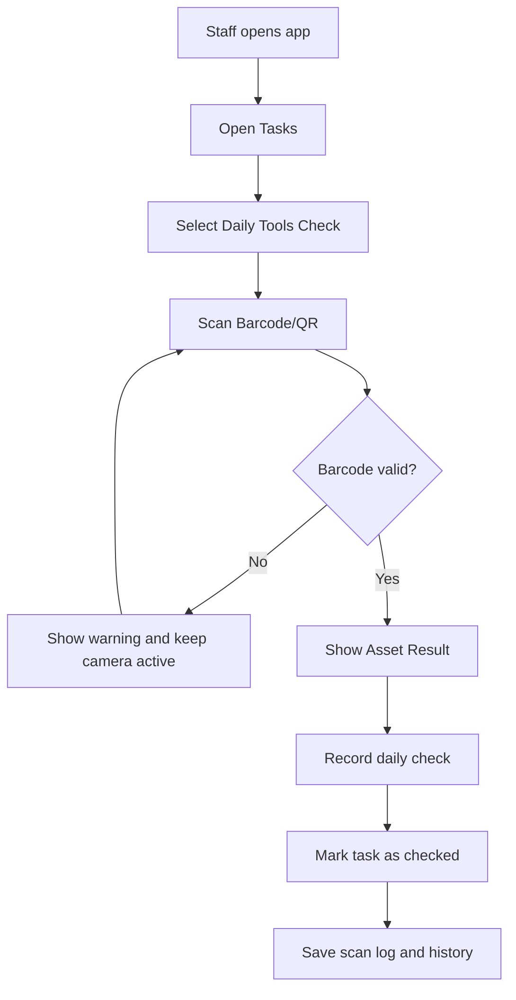

## 12.2 Staff Daily WFM Check Flow

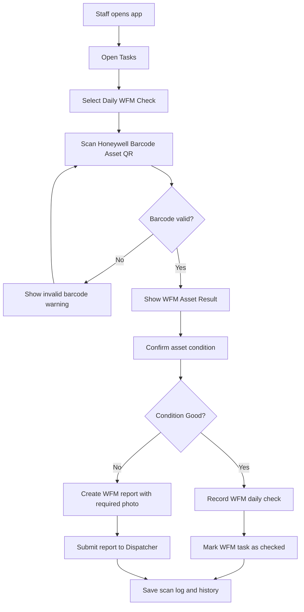

## 12.3 Weekly Check Flow

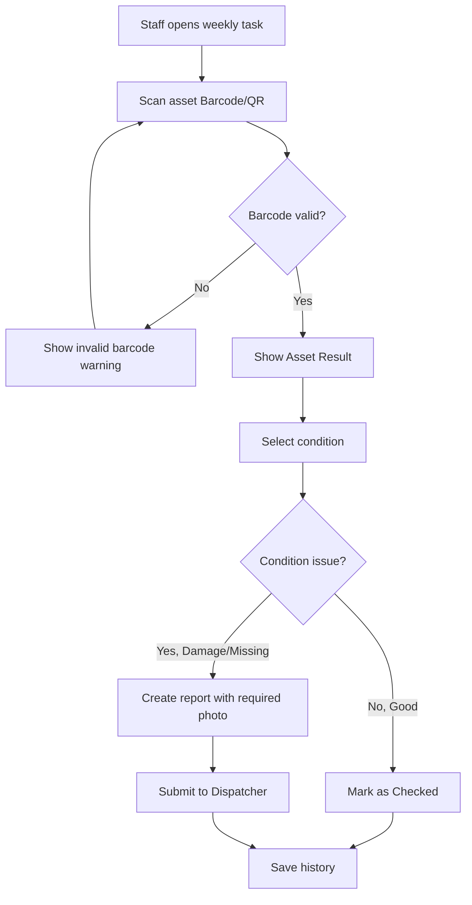

## 12.4 Monthly Inspection Flow

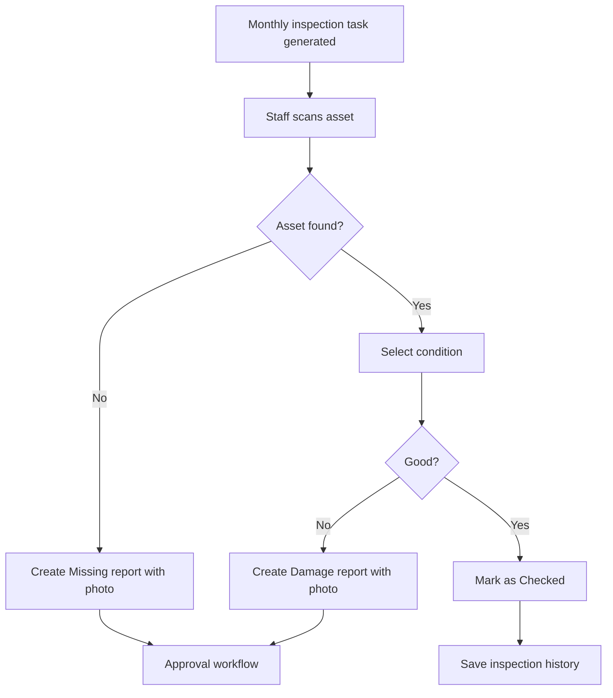

## 12.5 Damage/Missing Approval Flow

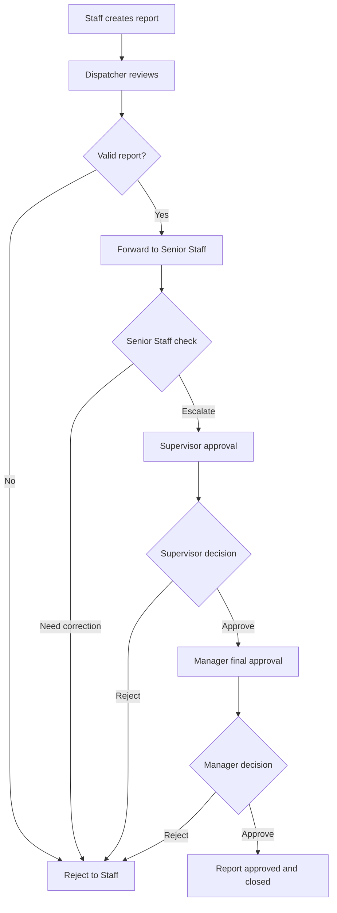

---

# 13. Main Mobile Screens

## 13.1 Login Page

Purpose:

- User login ke aplikasi.
- Sistem mengenali role user.
- Setelah login, user diarahkan sesuai role dan akses.

Required behavior:

- Validasi username/password.
- Tampilkan error jika login gagal.
- Simpan session/token setelah login berhasil.
- Integrasi dengan Supabase Auth.

## 13.2 Home Page

Purpose:

- Menampilkan ringkasan task dan status asset.
- Memberikan akses cepat ke scan, task, history, dan profile.

Possible content:

- Today's task summary.
- Daily Tools check progress.
- Daily WFM check progress.
- Weekly check progress.
- Monthly inspection progress.
- Pending report count.
- Missing asset count.

## 13.3 Task List Page

Purpose:

- Menampilkan daftar asset yang harus dicek.

Required content:

- Branch/office information.
- Progress inspection.
- Filter by All, Pending, Checked, Missing, Overdue.
- Asset cards.
- Asset name.
- Asset code.
- Asset category.
- Asset type.
- SN number if available.
- Location.
- Status.
- Action button to scan/check.

Required task tabs:

- Daily Tools
- Daily WFM
- Weekly
- Monthly
- Reports

## 13.4 Scan Page

Purpose:

- Menampilkan kamera untuk scan Barcode/QR.

Required behavior:

- Camera preview.
- Scan frame/guide.
- Flashlight control if supported.
- Back/close button.
- Camera permission state.
- Invalid barcode warning.
- Unclear barcode warning.
- No recent scanned items.
- No extra menu.

Validation:

- Jika barcode tidak sesuai format atau tidak ada di database, tampilkan warning.
- Jika kamera tidak jelas, terlalu gelap, terlalu jauh, atau tidak mengarah ke barcode, tampilkan helper warning.
- Jangan lanjut ke asset result jika barcode invalid.
- Jangan membuat inspection record jika barcode invalid.
- Cegah duplicate record akibat repeated camera detection.

## 13.5 Asset Result Page

Purpose:

- Menampilkan hasil scan asset.

Required content:

- Header: Scan Result.
- Success/identified state.
- Asset Identified.
- Asset name/type.
- Asset Details card.
- Asset Code.
- Asset Category.
- Asset Type.
- SN Number.
- Branch.
- Last Inspected.
- Last Scanned.
- Primary action: Start Inspection or Complete Daily Check.
- Secondary action: View History.

## 13.6 Inspection Page

Purpose:

- User memilih kondisi asset dan mengirim hasil pengecekan.

Required fields:

- Asset details.
- Condition selection:
  - Good
  - Minor Damage
  - Damaged
  - Missing
- Notes.
- Photo upload if required.
- Submit button.

Rules:

- Good tidak wajib foto.
- Minor Damage, Damaged, dan Missing wajib foto.
- Submit disabled jika required field belum lengkap.

## 13.7 Report Page

Purpose:

- Membuat report kerusakan atau missing asset.

Required fields:

- Asset ID.
- Asset code.
- Asset category.
- Asset type.
- SN number.
- Condition.
- Report description.
- Photo evidence.
- Reporter.
- Branch.
- Date/time.
- Location if available.

## 13.8 Approval Page

Purpose:

- Role Dispatcher, Senior Staff, Supervisor, dan Manager memproses report sesuai hak akses.

Actions by role:

- Dispatcher: review and forward.
- Senior Staff: check, reject, or escalate.
- Supervisor: approve or reject.
- Manager: final approve or reject.

## 13.9 History Page

Purpose:

- Menampilkan riwayat scan, inspection, report, dan approval.

Access rules:

- Staff: hanya melihat history miliknya.
- Dispatcher: melihat data Staff dan branch yang di-handle.
- Senior Staff/Supervisor: melihat semua branch pada regional yang di-handle.
- Manager: melihat semua branch pada semua regional yang di-handle.

Required features:

- Search bar.
- Sort.
- Filter.
- Detail history.
- Filter by category: Tools, WFM, Vehicle, Laptop.
- Filter by asset type: Honeywell Barcode, Splicer, OTDR, etc.

## 13.10 Profile Page

Purpose:

- Menampilkan informasi user dan akses pengaturan.

For Staff:

- Employee detail.
- Settings.
- Help Center.

For Dispatcher and above:

- Employee detail.
- Settings.
- Help Center.
- Additional operational access if needed.

---

# 14. Web Dashboard Requirements

Dashboard dibuat setelah mobile app normal, stabil, dan sudah diuji.

Dashboard access:

- Dispatcher
- Senior Staff
- Supervisor
- Manager
- Admin, jika dibutuhkan

Dashboard features:

1. Overview monitoring.
2. Branch monitoring.
3. Regional monitoring.
4. Asset list.
5. Asset detail.
6. Asset category management.
7. Asset type management.
8. Daily Tools tracking.
9. Daily WFM tracking.
10. Weekly check tracking.
11. Monthly inspection progress.
12. Damage report list.
13. Missing asset list.
14. Approval management.
15. History and audit log.
16. User management.
17. Role management.
18. Import asset data from spreadsheet.
19. Generate Barcode/QR.
20. Print Barcode/QR.
21. Export report.

Dashboard must not be built before mobile app core flow is stable.

## 14.1 Dashboard WFM Monitoring

Dashboard harus memiliki monitoring khusus WFM.

Required WFM metrics:

- Total WFM asset.
- Total Honeywell Barcode asset.
- WFM checked today.
- WFM pending today.
- WFM overdue today.
- WFM missing.
- WFM damaged.
- WFM by branch.
- WFM scan history.
- WFM monthly inspection progress.
- WFM report approval status.

Dashboard WFM filters:

- Region
- Branch
- Asset Type
- Status
- Condition
- Date range
- User/Staff

---

# 15. PostgreSQL/Supabase Database Plan

Database menggunakan PostgreSQL melalui Supabase.

Supabase components:

- Supabase Auth untuk login.
- PostgreSQL untuk relational data.
- Supabase Storage untuk photo evidence.
- Row Level Security untuk role-based access.
- Edge Functions atau Scheduled Jobs untuk task generation dan missing automation jika diperlukan.

Recommended core tables:

- users
- roles
- user_roles
- regions
- branches
- user_branch_assignments
- asset_categories
- asset_types
- assets
- asset_qr_codes
- inspection_tasks
- scan_logs
- inspections
- daily_checks
- weekly_checks
- monthly_inspections
- asset_reports
- report_photos
- approval_steps
- missing_events
- history_logs
- notifications

---

# 16. Main Entity Relationship

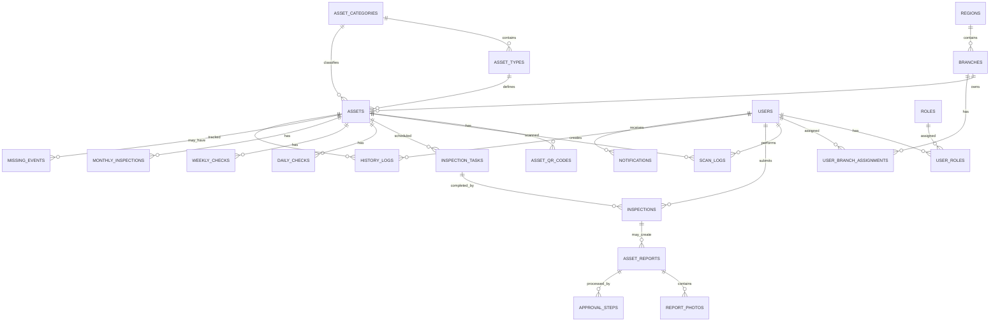

---

# 17. Database Schema Detail

## 17.1 regions

```sql
CREATE TABLE regions (
  id UUID PRIMARY KEY DEFAULT gen_random_uuid(),
  name TEXT NOT NULL,
  code TEXT UNIQUE,
  created_at TIMESTAMPTZ DEFAULT now(),
  updated_at TIMESTAMPTZ DEFAULT now()
);
```

## 17.2 branches

```sql
CREATE TABLE branches (
  id UUID PRIMARY KEY DEFAULT gen_random_uuid(),
  region_id UUID NOT NULL REFERENCES regions(id) ON DELETE RESTRICT,
  name TEXT NOT NULL,
  code TEXT UNIQUE,
  address TEXT,
  created_at TIMESTAMPTZ DEFAULT now(),
  updated_at TIMESTAMPTZ DEFAULT now()
);
```

## 17.3 users

Supabase Auth menangani akun utama. Tabel ini menyimpan profile operasional.

```sql
CREATE TABLE users (
  id UUID PRIMARY KEY REFERENCES auth.users(id) ON DELETE CASCADE,
  employee_id TEXT UNIQUE,
  full_name TEXT NOT NULL,
  email TEXT UNIQUE,
  phone TEXT,
  is_active BOOLEAN DEFAULT true,
  created_at TIMESTAMPTZ DEFAULT now(),
  updated_at TIMESTAMPTZ DEFAULT now()
);
```

## 17.4 roles

```sql
CREATE TABLE roles (
  id UUID PRIMARY KEY DEFAULT gen_random_uuid(),
  name TEXT NOT NULL UNIQUE,
  description TEXT,
  created_at TIMESTAMPTZ DEFAULT now()
);
```

Initial roles:

```text
staff
dispatcher
senior_staff
supervisor
manager
admin
```

## 17.5 user_roles

```sql
CREATE TABLE user_roles (
  id UUID PRIMARY KEY DEFAULT gen_random_uuid(),
  user_id UUID NOT NULL REFERENCES users(id) ON DELETE CASCADE,
  role_id UUID NOT NULL REFERENCES roles(id) ON DELETE CASCADE,
  created_at TIMESTAMPTZ DEFAULT now(),
  UNIQUE(user_id, role_id)
);
```

## 17.6 user_branch_assignments

```sql
CREATE TABLE user_branch_assignments (
  id UUID PRIMARY KEY DEFAULT gen_random_uuid(),
  user_id UUID NOT NULL REFERENCES users(id) ON DELETE CASCADE,
  branch_id UUID NOT NULL REFERENCES branches(id) ON DELETE CASCADE,
  assignment_type TEXT DEFAULT 'primary',
  created_at TIMESTAMPTZ DEFAULT now(),
  UNIQUE(user_id, branch_id)
);
```

## 17.7 asset_categories

Asset category adalah level utama. WFM wajib menjadi asset category tersendiri.

```sql
CREATE TABLE asset_categories (
  id UUID PRIMARY KEY DEFAULT gen_random_uuid(),
  name TEXT NOT NULL UNIQUE,
  code TEXT NOT NULL UNIQUE,
  description TEXT,
  default_check_frequency TEXT NOT NULL,
  requires_daily_check BOOLEAN DEFAULT false,
  requires_weekly_check BOOLEAN DEFAULT false,
  requires_monthly_inspection BOOLEAN DEFAULT true,
  is_active BOOLEAN DEFAULT true,
  created_at TIMESTAMPTZ DEFAULT now(),
  updated_at TIMESTAMPTZ DEFAULT now(),

  CONSTRAINT asset_categories_frequency_check CHECK (
    default_check_frequency IN ('daily', 'weekly', 'monthly', 'custom')
  )
);
```

Initial seed:

```sql
INSERT INTO asset_categories (
  name,
  code,
  description,
  default_check_frequency,
  requires_daily_check,
  requires_weekly_check,
  requires_monthly_inspection
)
VALUES
('Tools', 'TOOLS', 'Technical tools that require daily tracking', 'daily', true, false, true),
('WFM', 'WFM', 'WFM operational devices that require daily tracking', 'daily', true, false, true),
('Vehicle', 'VEH', 'Operational vehicles', 'weekly', false, true, true),
('Laptop', 'LAP', 'Operational laptops', 'weekly', false, true, true)
ON CONFLICT (code) DO NOTHING;
```

## 17.8 asset_types

Asset type berada di bawah asset category. Honeywell Barcode berada di bawah WFM.

```sql
CREATE TABLE asset_types (
  id UUID PRIMARY KEY DEFAULT gen_random_uuid(),
  category_id UUID NOT NULL REFERENCES asset_categories(id) ON DELETE RESTRICT,
  name TEXT NOT NULL,
  code TEXT NOT NULL,
  description TEXT,
  requires_daily_check BOOLEAN DEFAULT false,
  requires_weekly_check BOOLEAN DEFAULT false,
  requires_monthly_inspection BOOLEAN DEFAULT true,
  is_active BOOLEAN DEFAULT true,
  created_at TIMESTAMPTZ DEFAULT now(),
  updated_at TIMESTAMPTZ DEFAULT now(),

  UNIQUE(category_id, name),
  UNIQUE(category_id, code)
);
```

Initial seed for WFM:

```sql
INSERT INTO asset_types (
  category_id,
  name,
  code,
  description,
  requires_daily_check,
  requires_weekly_check,
  requires_monthly_inspection
)
SELECT
  id,
  'Honeywell Barcode',
  'HONEYWELL_BARCODE',
  'Honeywell Barcode device under WFM category. Must be scanned daily and inspected monthly.',
  true,
  false,
  true
FROM asset_categories
WHERE code = 'WFM'
ON CONFLICT (category_id, code) DO NOTHING;
```

Recommended seed for Tools:

```sql
INSERT INTO asset_types (
  category_id,
  name,
  code,
  description,
  requires_daily_check,
  requires_weekly_check,
  requires_monthly_inspection
)
SELECT id, 'Splicer', 'SPLICER', 'Fiber optic splicer', true, false, true
FROM asset_categories WHERE code = 'TOOLS'
ON CONFLICT (category_id, code) DO NOTHING;

INSERT INTO asset_types (
  category_id,
  name,
  code,
  description,
  requires_daily_check,
  requires_weekly_check,
  requires_monthly_inspection
)
SELECT id, 'OTDR', 'OTDR', 'Optical Time Domain Reflectometer', true, false, true
FROM asset_categories WHERE code = 'TOOLS'
ON CONFLICT (category_id, code) DO NOTHING;
```

## 17.9 assets

```sql
CREATE TABLE assets (
  id UUID PRIMARY KEY DEFAULT gen_random_uuid(),

  branch_id UUID NOT NULL REFERENCES branches(id) ON DELETE RESTRICT,
  category_id UUID NOT NULL REFERENCES asset_categories(id) ON DELETE RESTRICT,
  asset_type_id UUID NOT NULL REFERENCES asset_types(id) ON DELETE RESTRICT,

  asset_code TEXT NOT NULL UNIQUE,
  asset_name TEXT NOT NULL,
  serial_number TEXT,
  brand TEXT,
  model TEXT,

  physical_condition TEXT NOT NULL DEFAULT 'good',
  inspection_status TEXT NOT NULL DEFAULT 'pending',

  current_assigned_user_id UUID REFERENCES users(id) ON DELETE SET NULL,

  last_scanned_at TIMESTAMPTZ,
  last_inspected_at TIMESTAMPTZ,

  location_name TEXT,
  latitude NUMERIC(10, 7),
  longitude NUMERIC(10, 7),

  is_active BOOLEAN DEFAULT true,
  created_at TIMESTAMPTZ DEFAULT now(),
  updated_at TIMESTAMPTZ DEFAULT now(),

  CONSTRAINT assets_physical_condition_check CHECK (
    physical_condition IN ('good', 'minor_damage', 'damaged', 'missing')
  ),

  CONSTRAINT assets_inspection_status_check CHECK (
    inspection_status IN ('pending', 'checked', 'missing', 'overdue')
  )
);
```

Example WFM asset:

```sql
INSERT INTO assets (
  branch_id,
  category_id,
  asset_type_id,
  asset_code,
  asset_name,
  serial_number,
  brand,
  model,
  physical_condition,
  inspection_status
)
SELECT
  b.id,
  ac.id,
  at.id,
  'WFM-HB-DPS-001',
  'Honeywell Barcode Scanner 001',
  'SN-HB-001',
  'Honeywell',
  'Barcode Scanner',
  'good',
  'pending'
FROM branches b
JOIN asset_categories ac ON ac.code = 'WFM'
JOIN asset_types at ON at.category_id = ac.id AND at.code = 'HONEYWELL_BARCODE'
WHERE b.code = 'DPS'
LIMIT 1;
```

## 17.10 asset_qr_codes

```sql
CREATE TABLE asset_qr_codes (
  id UUID PRIMARY KEY DEFAULT gen_random_uuid(),
  asset_id UUID NOT NULL REFERENCES assets(id) ON DELETE CASCADE,
  qr_value TEXT NOT NULL UNIQUE,
  qr_format TEXT DEFAULT 'QR',
  is_active BOOLEAN DEFAULT true,
  generated_by UUID REFERENCES users(id) ON DELETE SET NULL,
  generated_at TIMESTAMPTZ DEFAULT now(),
  printed_at TIMESTAMPTZ,
  created_at TIMESTAMPTZ DEFAULT now()
);
```

## 17.11 inspection_tasks

Task generator membuat task harian/mingguan/bulanan berdasarkan category dan type rules.

```sql
CREATE TABLE inspection_tasks (
  id UUID PRIMARY KEY DEFAULT gen_random_uuid(),

  asset_id UUID NOT NULL REFERENCES assets(id) ON DELETE CASCADE,
  branch_id UUID NOT NULL REFERENCES branches(id) ON DELETE RESTRICT,
  assigned_user_id UUID REFERENCES users(id) ON DELETE SET NULL,

  task_type TEXT NOT NULL,
  task_date DATE NOT NULL,
  period_start DATE NOT NULL,
  period_end DATE NOT NULL,

  status TEXT NOT NULL DEFAULT 'pending',

  completed_at TIMESTAMPTZ,
  completed_by UUID REFERENCES users(id) ON DELETE SET NULL,

  created_at TIMESTAMPTZ DEFAULT now(),
  updated_at TIMESTAMPTZ DEFAULT now(),

  CONSTRAINT inspection_tasks_task_type_check CHECK (
    task_type IN ('daily_check', 'weekly_check', 'monthly_inspection')
  ),

  CONSTRAINT inspection_tasks_status_check CHECK (
    status IN ('pending', 'checked', 'missing', 'overdue')
  ),

  UNIQUE(asset_id, task_type, period_start, period_end)
);
```

WFM task rule:

```text
If asset_categories.code = 'WFM'
and asset_types.code = 'HONEYWELL_BARCODE'
then generate daily_check task every day.
```

## 17.12 scan_logs

```sql
CREATE TABLE scan_logs (
  id UUID PRIMARY KEY DEFAULT gen_random_uuid(),

  asset_id UUID REFERENCES assets(id) ON DELETE SET NULL,
  user_id UUID NOT NULL REFERENCES users(id) ON DELETE RESTRICT,
  branch_id UUID REFERENCES branches(id) ON DELETE SET NULL,

  qr_value TEXT NOT NULL,
  scan_result TEXT NOT NULL,
  scan_context TEXT,

  scanned_at TIMESTAMPTZ DEFAULT now(),
  latitude NUMERIC(10, 7),
  longitude NUMERIC(10, 7),
  device_info JSONB,

  created_at TIMESTAMPTZ DEFAULT now(),

  CONSTRAINT scan_logs_scan_result_check CHECK (
    scan_result IN ('valid', 'invalid')
  ),

  CONSTRAINT scan_logs_scan_context_check CHECK (
    scan_context IN ('daily_check', 'weekly_check', 'monthly_inspection', 'general_scan')
  )
);
```

## 17.13 inspections

```sql
CREATE TABLE inspections (
  id UUID PRIMARY KEY DEFAULT gen_random_uuid(),

  task_id UUID REFERENCES inspection_tasks(id) ON DELETE SET NULL,
  asset_id UUID NOT NULL REFERENCES assets(id) ON DELETE CASCADE,
  user_id UUID NOT NULL REFERENCES users(id) ON DELETE RESTRICT,
  branch_id UUID NOT NULL REFERENCES branches(id) ON DELETE RESTRICT,

  inspection_type TEXT NOT NULL,
  physical_condition TEXT NOT NULL,
  notes TEXT,

  photo_required BOOLEAN DEFAULT false,
  has_photo BOOLEAN DEFAULT false,

  inspected_at TIMESTAMPTZ DEFAULT now(),
  latitude NUMERIC(10, 7),
  longitude NUMERIC(10, 7),

  created_at TIMESTAMPTZ DEFAULT now(),

  CONSTRAINT inspections_inspection_type_check CHECK (
    inspection_type IN ('daily_check', 'weekly_check', 'monthly_inspection')
  ),

  CONSTRAINT inspections_physical_condition_check CHECK (
    physical_condition IN ('good', 'minor_damage', 'damaged', 'missing')
  )
);
```

## 17.14 daily_checks

```sql
CREATE TABLE daily_checks (
  id UUID PRIMARY KEY DEFAULT gen_random_uuid(),

  task_id UUID REFERENCES inspection_tasks(id) ON DELETE SET NULL,
  asset_id UUID NOT NULL REFERENCES assets(id) ON DELETE CASCADE,
  user_id UUID NOT NULL REFERENCES users(id) ON DELETE RESTRICT,
  branch_id UUID NOT NULL REFERENCES branches(id) ON DELETE RESTRICT,

  check_date DATE NOT NULL,
  status TEXT NOT NULL DEFAULT 'checked',

  scan_log_id UUID REFERENCES scan_logs(id) ON DELETE SET NULL,
  inspection_id UUID REFERENCES inspections(id) ON DELETE SET NULL,

  created_at TIMESTAMPTZ DEFAULT now(),

  CONSTRAINT daily_checks_status_check CHECK (
    status IN ('checked', 'missing', 'overdue')
  ),

  UNIQUE(asset_id, check_date)
);
```

Daily check applies to:

```text
Asset Category: Tools
Asset Category: WFM
```

## 17.15 weekly_checks

```sql
CREATE TABLE weekly_checks (
  id UUID PRIMARY KEY DEFAULT gen_random_uuid(),

  task_id UUID REFERENCES inspection_tasks(id) ON DELETE SET NULL,
  asset_id UUID NOT NULL REFERENCES assets(id) ON DELETE CASCADE,
  user_id UUID REFERENCES users(id) ON DELETE SET NULL,
  branch_id UUID NOT NULL REFERENCES branches(id) ON DELETE RESTRICT,

  week_start DATE NOT NULL,
  week_end DATE NOT NULL,
  status TEXT NOT NULL DEFAULT 'pending',

  inspection_id UUID REFERENCES inspections(id) ON DELETE SET NULL,

  created_at TIMESTAMPTZ DEFAULT now(),

  CONSTRAINT weekly_checks_status_check CHECK (
    status IN ('pending', 'checked', 'missing', 'overdue')
  ),

  UNIQUE(asset_id, week_start, week_end)
);
```

Weekly check applies to:

```text
Vehicle
Laptop
Other non-daily categories
```

WFM does not need weekly check because WFM is daily check.

## 17.16 monthly_inspections

```sql
CREATE TABLE monthly_inspections (
  id UUID PRIMARY KEY DEFAULT gen_random_uuid(),

  task_id UUID REFERENCES inspection_tasks(id) ON DELETE SET NULL,
  asset_id UUID NOT NULL REFERENCES assets(id) ON DELETE CASCADE,
  user_id UUID REFERENCES users(id) ON DELETE SET NULL,
  branch_id UUID NOT NULL REFERENCES branches(id) ON DELETE RESTRICT,

  month_period DATE NOT NULL,
  status TEXT NOT NULL DEFAULT 'pending',

  inspection_id UUID REFERENCES inspections(id) ON DELETE SET NULL,

  created_at TIMESTAMPTZ DEFAULT now(),

  CONSTRAINT monthly_inspections_status_check CHECK (
    status IN ('pending', 'checked', 'missing', 'overdue')
  ),

  UNIQUE(asset_id, month_period)
);
```

Monthly inspection applies to all categories.

## 17.17 asset_reports

```sql
CREATE TABLE asset_reports (
  id UUID PRIMARY KEY DEFAULT gen_random_uuid(),

  asset_id UUID NOT NULL REFERENCES assets(id) ON DELETE CASCADE,
  inspection_id UUID REFERENCES inspections(id) ON DELETE SET NULL,
  reporter_id UUID NOT NULL REFERENCES users(id) ON DELETE RESTRICT,
  branch_id UUID NOT NULL REFERENCES branches(id) ON DELETE RESTRICT,

  report_type TEXT NOT NULL,
  condition TEXT NOT NULL,
  description TEXT NOT NULL,

  workflow_status TEXT NOT NULL DEFAULT 'submitted',
  current_approval_level TEXT DEFAULT 'dispatcher',

  submitted_at TIMESTAMPTZ DEFAULT now(),
  closed_at TIMESTAMPTZ,

  created_at TIMESTAMPTZ DEFAULT now(),
  updated_at TIMESTAMPTZ DEFAULT now(),

  CONSTRAINT asset_reports_report_type_check CHECK (
    report_type IN ('minor_damage', 'damage', 'missing')
  ),

  CONSTRAINT asset_reports_condition_check CHECK (
    condition IN ('minor_damage', 'damaged', 'missing')
  ),

  CONSTRAINT asset_reports_workflow_status_check CHECK (
    workflow_status IN (
      'draft',
      'submitted',
      'reviewed_by_dispatcher',
      'escalated_to_senior_staff',
      'escalated_to_supervisor',
      'approved_by_supervisor',
      'final_approved',
      'rejected',
      'closed'
    )
  )
);
```

## 17.18 report_photos

```sql
CREATE TABLE report_photos (
  id UUID PRIMARY KEY DEFAULT gen_random_uuid(),

  report_id UUID NOT NULL REFERENCES asset_reports(id) ON DELETE CASCADE,
  inspection_id UUID REFERENCES inspections(id) ON DELETE SET NULL,
  asset_id UUID NOT NULL REFERENCES assets(id) ON DELETE CASCADE,

  uploaded_by UUID NOT NULL REFERENCES users(id) ON DELETE RESTRICT,

  storage_bucket TEXT NOT NULL DEFAULT 'asset-report-photos',
  storage_path TEXT NOT NULL,
  public_url TEXT,

  latitude NUMERIC(10, 7),
  longitude NUMERIC(10, 7),

  created_at TIMESTAMPTZ DEFAULT now()
);
```

## 17.19 approval_steps

```sql
CREATE TABLE approval_steps (
  id UUID PRIMARY KEY DEFAULT gen_random_uuid(),

  report_id UUID NOT NULL REFERENCES asset_reports(id) ON DELETE CASCADE,
  actor_id UUID NOT NULL REFERENCES users(id) ON DELETE RESTRICT,

  role_name TEXT NOT NULL,
  action TEXT NOT NULL,
  notes TEXT,

  from_status TEXT,
  to_status TEXT,

  acted_at TIMESTAMPTZ DEFAULT now(),

  CONSTRAINT approval_steps_role_name_check CHECK (
    role_name IN ('dispatcher', 'senior_staff', 'supervisor', 'manager')
  ),

  CONSTRAINT approval_steps_action_check CHECK (
    action IN ('review', 'forward', 'check', 'escalate', 'approve', 'final_approve', 'reject')
  )
);
```

## 17.20 missing_events

```sql
CREATE TABLE missing_events (
  id UUID PRIMARY KEY DEFAULT gen_random_uuid(),

  asset_id UUID NOT NULL REFERENCES assets(id) ON DELETE CASCADE,
  branch_id UUID NOT NULL REFERENCES branches(id) ON DELETE RESTRICT,

  detected_by UUID REFERENCES users(id) ON DELETE SET NULL,
  detection_type TEXT NOT NULL,

  reason TEXT,
  last_scanned_at TIMESTAMPTZ,
  detected_at TIMESTAMPTZ DEFAULT now(),

  report_id UUID REFERENCES asset_reports(id) ON DELETE SET NULL,

  created_at TIMESTAMPTZ DEFAULT now(),

  CONSTRAINT missing_events_detection_type_check CHECK (
    detection_type IN ('manual', 'automatic')
  )
);
```

## 17.21 history_logs

```sql
CREATE TABLE history_logs (
  id UUID PRIMARY KEY DEFAULT gen_random_uuid(),

  user_id UUID REFERENCES users(id) ON DELETE SET NULL,
  asset_id UUID REFERENCES assets(id) ON DELETE SET NULL,
  branch_id UUID REFERENCES branches(id) ON DELETE SET NULL,

  event_type TEXT NOT NULL,
  event_title TEXT NOT NULL,
  event_description TEXT,

  reference_table TEXT,
  reference_id UUID,

  metadata JSONB,

  created_at TIMESTAMPTZ DEFAULT now()
);
```

## 17.22 notifications

```sql
CREATE TABLE notifications (
  id UUID PRIMARY KEY DEFAULT gen_random_uuid(),

  user_id UUID NOT NULL REFERENCES users(id) ON DELETE CASCADE,
  title TEXT NOT NULL,
  message TEXT NOT NULL,

  notification_type TEXT,
  reference_table TEXT,
  reference_id UUID,

  is_read BOOLEAN DEFAULT false,

  created_at TIMESTAMPTZ DEFAULT now()
);
```

---

# 18. WFM Correlation Detail

## 18.1 WFM Category Relation

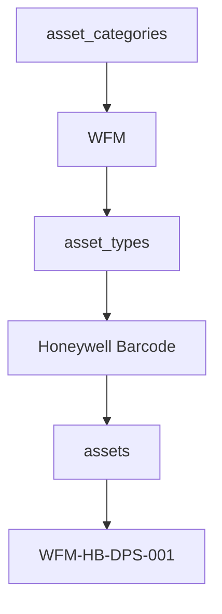

Database relation:

```text
asset_categories.id -> asset_types.category_id
asset_types.id -> assets.asset_type_id
asset_categories.id -> assets.category_id
```

## 18.2 WFM Daily Check Relation

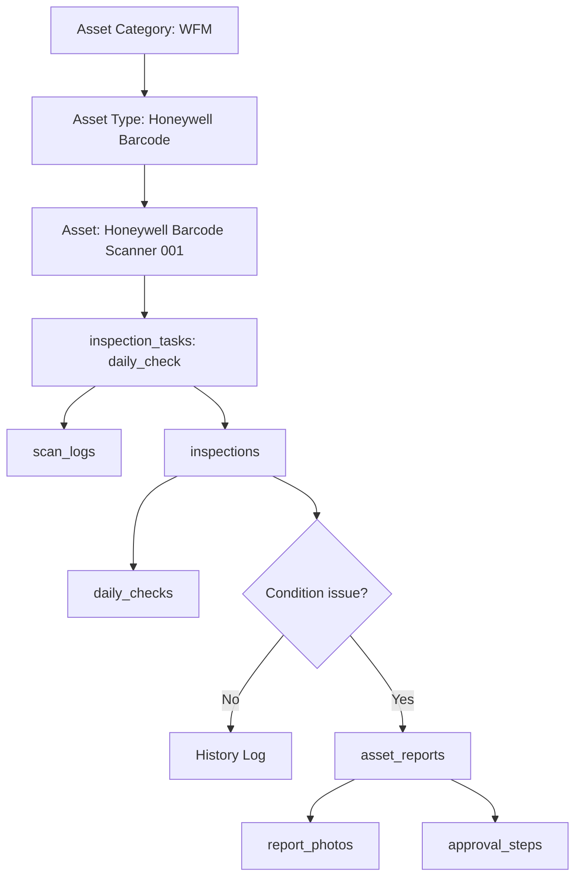

## 18.3 WFM Dashboard Relation

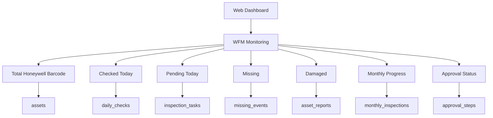

---

# 19. Recommended Dashboard Queries

## 19.1 Total WFM by Branch

```sql
SELECT
  b.name AS branch_name,
  COUNT(a.id) AS total_wfm
FROM assets a
JOIN branches b ON b.id = a.branch_id
JOIN asset_categories ac ON ac.id = a.category_id
WHERE ac.code = 'WFM'
  AND a.is_active = true
GROUP BY b.name
ORDER BY b.name;
```

## 19.2 WFM Daily Progress

```sql
SELECT
  b.name AS branch_name,
  COUNT(a.id) AS total_wfm,
  COUNT(dc.id) FILTER (WHERE dc.status = 'checked') AS checked_today,
  COUNT(a.id) - COUNT(dc.id) FILTER (WHERE dc.status = 'checked') AS pending_today
FROM assets a
JOIN branches b ON b.id = a.branch_id
JOIN asset_categories ac ON ac.id = a.category_id
LEFT JOIN daily_checks dc
  ON dc.asset_id = a.id
  AND dc.check_date = CURRENT_DATE
WHERE ac.code = 'WFM'
  AND a.is_active = true
GROUP BY b.name
ORDER BY b.name;
```

## 19.3 WFM Missing List

```sql
SELECT
  a.asset_code,
  a.asset_name,
  at.name AS asset_type,
  b.name AS branch_name,
  a.last_scanned_at,
  a.physical_condition
FROM assets a
JOIN asset_categories ac ON ac.id = a.category_id
JOIN asset_types at ON at.id = a.asset_type_id
JOIN branches b ON b.id = a.branch_id
WHERE ac.code = 'WFM'
  AND a.physical_condition = 'missing'
ORDER BY a.last_scanned_at ASC NULLS FIRST;
```

## 19.4 WFM Report Approval Status

```sql
SELECT
  ar.id,
  a.asset_code,
  a.asset_name,
  ar.report_type,
  ar.workflow_status,
  ar.current_approval_level,
  ar.submitted_at
FROM asset_reports ar
JOIN assets a ON a.id = ar.asset_id
JOIN asset_categories ac ON ac.id = a.category_id
WHERE ac.code = 'WFM'
ORDER BY ar.submitted_at DESC;
```

---

# 20. Backend Readiness

Mobile app harus disiapkan agar mudah dihubungkan ke backend.

Frontend should avoid:

- Data hardcoded permanen.
- Logic status yang tersebar di banyak komponen.
- Role access yang hanya dikunci di UI.
- Mock data tanpa struktur jelas.
- Hardcode kategori WFM hanya di UI.
- Hardcode Honeywell Barcode hanya di komponen tertentu.

Frontend should prepare:

- Central API service layer.
- Type/model untuk User, Role, AssetCategory, AssetType, Asset, InspectionTask, Inspection, Report, Approval, Branch, Region.
- Auth token handling.
- Error handling.
- Loading states.
- Empty states.
- Permission states.
- Retry behavior.
- Pagination for long lists.
- Filter by category and asset type.
- Reusable task rendering for Tools Daily, WFM Daily, Weekly, and Monthly.

Recommended TypeScript models:

```ts
type AssetCategoryCode = 'TOOLS' | 'WFM' | 'VEH' | 'LAP';

type InspectionTaskType =
  | 'daily_check'
  | 'weekly_check'
  | 'monthly_inspection';

type AssetCondition =
  | 'good'
  | 'minor_damage'
  | 'damaged'
  | 'missing';

interface AssetCategory {
  id: string;
  name: string;
  code: AssetCategoryCode;
  requiresDailyCheck: boolean;
  requiresWeeklyCheck: boolean;
  requiresMonthlyInspection: boolean;
}

interface AssetType {
  id: string;
  categoryId: string;
  name: string;
  code: string;
  requiresDailyCheck: boolean;
  requiresWeeklyCheck: boolean;
  requiresMonthlyInspection: boolean;
}

interface Asset {
  id: string;
  branchId: string;
  categoryId: string;
  assetTypeId: string;
  assetCode: string;
  assetName: string;
  serialNumber?: string;
  brand?: string;
  model?: string;
  physicalCondition: AssetCondition;
  inspectionStatus: 'pending' | 'checked' | 'missing' | 'overdue';
  lastScannedAt?: string;
  lastInspectedAt?: string;
}
```

---

# 21. Suggested API Modules

Future backend API modules:

- Auth API
- User API
- Role API
- Branch API
- Region API
- Asset Category API
- Asset Type API
- Asset API
- QR/Barcode API
- Scan API
- Inspection Task API
- Inspection API
- Daily Check API
- Weekly Check API
- Monthly Inspection API
- Asset Report API
- Report Photo API
- Approval API
- Missing Event API
- History API
- Dashboard API
- Notification API

---

# 22. API Endpoint Draft

## 22.1 Asset Category

```text
GET    /asset-categories
POST   /asset-categories
PATCH  /asset-categories/:id
DELETE /asset-categories/:id
```

## 22.2 Asset Type

```text
GET    /asset-types
GET    /asset-types?category=WFM
POST   /asset-types
PATCH  /asset-types/:id
DELETE /asset-types/:id
```

## 22.3 WFM Assets

```text
GET /assets?category=WFM
GET /assets?category=WFM&type=HONEYWELL_BARCODE
GET /dashboard/wfm/summary
GET /dashboard/wfm/daily-progress
GET /dashboard/wfm/missing
GET /dashboard/wfm/reports
```

## 22.4 Scan

```text
POST /scan/validate
POST /scan/record
```

## 22.5 Daily Check

```text
GET  /tasks/daily?category=TOOLS
GET  /tasks/daily?category=WFM
POST /daily-checks
```

## 22.6 Monthly Inspection

```text
GET  /tasks/monthly
POST /monthly-inspections
```

---

# 23. Task Generation Logic

## 23.1 Daily Task Generation

Daily tasks are generated for asset categories that require daily check.

Logic:

```pseudo
For each active asset:
  if asset.category.requires_daily_check = true:
    create inspection_task:
      task_type = daily_check
      task_date = today
      period_start = today
      period_end = today
      status = pending
```

Applies to:

```text
Tools
WFM
```

## 23.2 Weekly Task Generation

Weekly tasks are generated every Monday for asset categories that require weekly check.

Logic:

```pseudo
For each active asset:
  if asset.category.requires_weekly_check = true:
    create inspection_task:
      task_type = weekly_check
      task_date = current Monday
      period_start = current Monday
      period_end = current Sunday
      status = pending
```

Applies to:

```text
Vehicle
Laptop
```

## 23.3 Monthly Task Generation

Monthly tasks are generated for all active assets.

Logic:

```pseudo
For each active asset:
  if asset.category.requires_monthly_inspection = true:
    create inspection_task:
      task_type = monthly_inspection
      task_date = first day of month
      period_start = first day of month
      period_end = last day of month
      status = pending
```

Applies to:

```text
Tools
WFM
Vehicle
Laptop
```

---

# 24. Supabase RLS Recommendation

Important RLS rules:

1. Staff can only read assigned tasks and own history.
2. Staff can insert scans and inspections for assigned branch.
3. Staff cannot update approval status.
4. Dispatcher can read reports from assigned branch.
5. Senior Staff can read reports from assigned regional branches.
6. Supervisor can approve/reject reports within assigned area.
7. Manager can read and final approve reports within managed region.
8. Staff cannot access dashboard data.
9. Dashboard API should enforce role access on backend/RLS, not only frontend.

---

# 25. Testing Plan Before Dashboard

Sebelum membuat dashboard, mobile app wajib dites penuh menggunakan Codex dengan 3 agent.

## Agent 1 - Route and Navigation Review

Responsibility:

- Inspect all routes/screens.
- List every route.
- Check whether each route is reachable.
- Identify broken navigation.
- Identify duplicate routes.
- Identify hidden or unclear routes.
- Verify bottom navigation, scan flow, asset result flow, inspection flow, report flow, approval flow, history, and profile.
- Verify new WFM daily task route.
- Verify WFM asset result route.
- Verify WFM report flow.

Important rule:

If any route/page/component seems unused, Codex must report it first and ask permission before deletion.

## Agent 2 - UI and User Flow Testing

Responsibility:

- Test app from user perspective.
- Verify Staff flow.
- Verify Dispatcher flow.
- Verify Senior Staff flow.
- Verify Supervisor flow.
- Verify Manager flow.
- Test task filters.
- Test scan validation.
- Test asset result.
- Test report submission.
- Test photo requirement.
- Test approval actions.
- Test history access.
- Test mobile responsiveness.
- Test Daily Tools task.
- Test Daily WFM task.
- Test Honeywell Barcode scan flow.
- Test WFM pending/checked/missing visual status.

## Agent 3 - Code Structure and Backend Readiness

Responsibility:

- Review code structure.
- Identify mock data.
- Identify duplicated logic.
- Identify unused components.
- Identify API integration points.
- Suggest backend contracts.
- Check whether frontend is ready for PostgreSQL-backed API integration.
- Ensure WFM is not hardcoded incorrectly.
- Ensure Asset Category and Asset Type are data-driven.
- Ensure Honeywell Barcode is treated as asset type under WFM category.

## Deletion Rule

Codex must not delete routes, pages, components, or files without approval.

Any cleanup proposal must include:

- File or route name.
- Why it seems unused.
- Risk if removed.
- Recommendation.
- Request for user confirmation.

---

# 26. Non-Functional Requirements

## 26.1 Performance

- App should be usable by at least 1000 users.
- List and history should support pagination or lazy loading.
- Scan action should respond quickly.
- Dashboard should use filtering and pagination for large data.
- Dashboard summary should use optimized queries or views when needed.

## 26.2 Security

- Role-based access control required.
- Staff cannot access dashboard.
- Staff cannot approve reports.
- Senior Staff cannot perform final approval.
- Supervisor and Manager approval must be logged.
- All scan, report, and approval actions must create audit logs.
- RLS should be enabled on production tables.

## 26.3 Reliability

- Scan result must not create duplicate records due to repeated camera detection.
- Invalid Barcode/QR must not create inspection data.
- Missing automation must run consistently.
- Photo evidence must be linked to the correct report.
- WFM daily check must not create duplicate check record for the same asset and date.

## 26.4 Auditability

Every important event must be logged:

- Login.
- Scan.
- Daily Tools check.
- Daily WFM check.
- Weekly check.
- Monthly inspection.
- Condition update.
- Damage report submission.
- Missing report.
- Approval.
- Reject.
- Escalation.
- QR generation.
- Asset data update.
- Asset category update.
- Asset type update.

---

# 27. Design Direction

General design instruction:

For this product and all future UI updates, the result must be elegant, professional, clean, and suitable for a modern mobile asset inspection application.

Design principles:

- Prioritize clean layout.
- Use good spacing.
- Keep clear visual hierarchy.
- Make every screen easy to scan.
- Keep mobile usability comfortable.
- Use compact but readable components.
- Avoid messy layouts.
- Avoid oversized elements.
- Avoid excessive whitespace.
- Avoid overly rounded components.
- Avoid decorative landing-page style.
- Keep buttons, cards, filters, icons, and text balanced.
- Use consistent colors, typography, icon style, border radius, and spacing.
- Important information should stand out clearly without making the UI crowded.
- Preserve existing functionality unless explicitly asked to change it.
- WFM should appear as a clear operational category, not hidden under Tools.

---

# 28. Success Criteria

Mobile app phase is considered successful when:

1. Staff can login.
2. Staff can see assigned tasks.
3. Staff can scan valid Barcode/QR.
4. Invalid Barcode/QR shows warning.
5. Asset result displays correct data.
6. Daily Tools check works.
7. Daily WFM check works.
8. Honeywell Barcode under WFM can be scanned successfully.
9. Weekly check works.
10. Monthly inspection works.
11. Minor Damage/Damaged/Missing requires photo.
12. Good asset can be marked Checked without photo.
13. Missing automation rule is defined and ready for backend.
14. Damage/missing report follows approval flow.
15. Dispatcher can forward report.
16. Senior Staff can check and escalate.
17. Supervisor can approve/reject.
18. Manager can final approve/reject.
19. History access follows role permissions.
20. Routes and pages are fully tested.
21. No unclear route is removed without approval.
22. Code is ready for backend integration.
23. WFM is implemented as Asset Category.
24. Honeywell Barcode is implemented as Asset Type under WFM.
25. Dashboard plan supports WFM monitoring.

---

# 29. Recommended Build Roadmap

## Phase 1 - PRD and Design Finalization

- Finalize PRD.
- Finalize WFM category rules.
- Finalize Honeywell Barcode asset type fields.
- Finalize mobile screen design.
- Finalize roles and permissions.
- Finalize asset status rules.
- Finalize inspection schedule rules.

## Phase 2 - Mobile App Prototype

- Build core mobile screens.
- Use mock data from spreadsheet structure.
- Build scan flow.
- Build task list.
- Build asset result.
- Build inspection and report flow.
- Add Daily WFM task.
- Add Honeywell Barcode scan scenario.

## Phase 3 - Mobile App Testing

- Test using Codex 3 agents.
- Fix route issues.
- Fix UI issues.
- Fix user flow issues.
- Fix backend readiness issues.
- Remove unused pages only after approval.

## Phase 4 - Backend PostgreSQL/Supabase

- Design database schema.
- Build API.
- Connect mobile app to backend.
- Implement auth and role access.
- Implement scan logs, inspection logs, reports, approvals, and history.
- Implement WFM daily check generation.
- Implement Honeywell Barcode asset import/generation.

## Phase 5 - Web Dashboard

- Build dashboard for Dispatcher and above.
- Add monitoring and approval.
- Add asset management.
- Add asset category/type management.
- Add QR generation and print.
- Add import/export tools.
- Add WFM dashboard monitoring.

## Phase 6 - Integration

- Explore WFM/POP integration.
- Explore operational report integration.
- Prepare production deployment.
- Prepare mass usage rollout.

---

# 30. Open Questions

These questions should be finalized before development:

1. What exact Barcode/QR format should be used?
2. Should QR contain only asset ID or also encoded metadata?
3. What spreadsheet columns are currently available?
4. Should scan location/GPS be mandatory?
5. Should daily Tools check allow offline scan?
6. Should daily WFM check allow offline scan?
7. Should Missing automatic rule run daily at midnight?
8. Who receives notification when asset becomes Missing?
9. What is the exact difference between branch, hub, regional, and office in the database?
10. Should damaged asset approval always go to Manager, or can certain minor reports be closed earlier in the future?
11. Where should photos be stored: database, object storage, or external storage?
12. What backend stack will be used with PostgreSQL/Supabase?
13. Is web dashboard built with the same codebase or separate app?
14. What exact model/version of Honeywell Barcode device will be used?
15. Does each Honeywell Barcode device have serial number or IMEI that must be stored?
16. Should WFM be assigned to individual staff or branch inventory?
17. Should WFM daily check be completed by assigned user only or any staff in the branch?

---

# 31. Final Product Statement

Network Operation East 3 Asset Inspection System is a mobile-first asset tracking and inspection platform that uses Barcode/QR scanning to monitor Tools, WFM, Vehicle, Laptop, and future asset categories across branches and regions.

The system supports:

- Daily Tools tracking.
- Daily WFM tracking.
- Honeywell Barcode as Asset Type under WFM.
- Weekly checks for non-daily assets.
- Monthly inspection for all assets.
- Automatic Missing detection.
- Photo-based damage/missing reporting.
- Role-based approval from Staff to Manager.
- Web dashboard monitoring after mobile app is stable.
- PostgreSQL/Supabase backend readiness.
- Complete history and audit trail.

The mobile app must be completed and tested first. After the mobile app is stable and verified, the product will continue with PostgreSQL/Supabase backend integration and a web dashboard for Dispatcher, Senior Staff, Supervisor, Manager, and Admin if needed.
